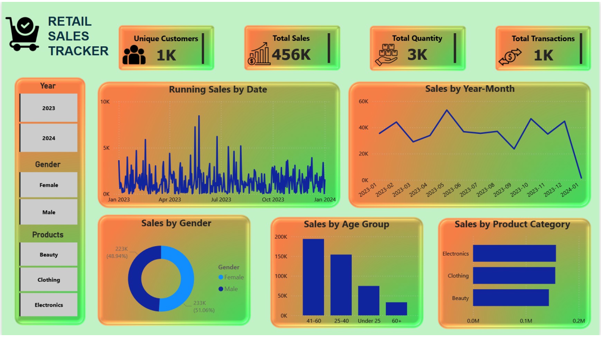

# 🛒 Retail Sales Tracker (Power BI Project)

## 📊 Overview
The **Retail Sales Tracker** is an interactive Power BI dashboard designed to provide insights into retail performance. It enables users to monitor key sales metrics, analyze customer behavior, and identify trends across different dimensions such as time, gender, age group, and product categories.

This project demonstrates practical data visualization, business intelligence, and reporting skills using Power BI.

---

## 🚀 Features
- 📈 **Sales Performance Tracking**
  - Total Sales
  - Total Quantity Sold
  - Total Transactions

- 👥 **Customer Insights**
  - Unique customer count
  - Sales distribution by gender
  - Sales by age group

- 📅 **Time-Based Analysis**
  - Running sales trends by date
  - Monthly sales comparison (Year-Month view)

- 🛍️ **Product Analysis**
  - Sales breakdown by product categories (Electronics, Clothing, Beauty)

- 🎯 **Interactive Filters**
  - Year filter (2023, 2024)
  - Gender filter
  - Product category filter

---

## 🖼️ Dashboard Preview

---

## 📁 Project Structure
